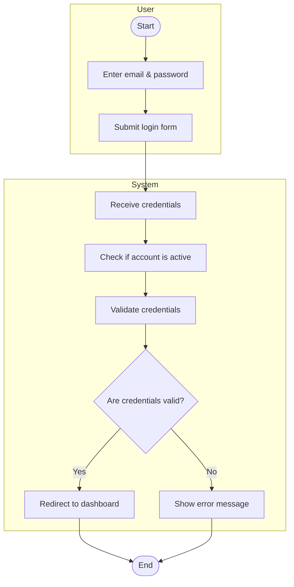

```mermaid
flowchart TD
    subgraph User
        A1([Start]) --> A2[Enter email & password]
        A2 --> A3[Submit login form]
    end

    subgraph System
        B1[Receive credentials]
        B2[Check if account is active]
        B3[Validate credentials]
        B4{Are credentials valid?}
        B5[Redirect to dashboard]
        B6[Show error message]
    end

    A3 --> B1 --> B2 --> B3 --> B4
    B4 -- Yes --> B5 --> A4([End])
    B4 -- No --> B6 --> A4
```
