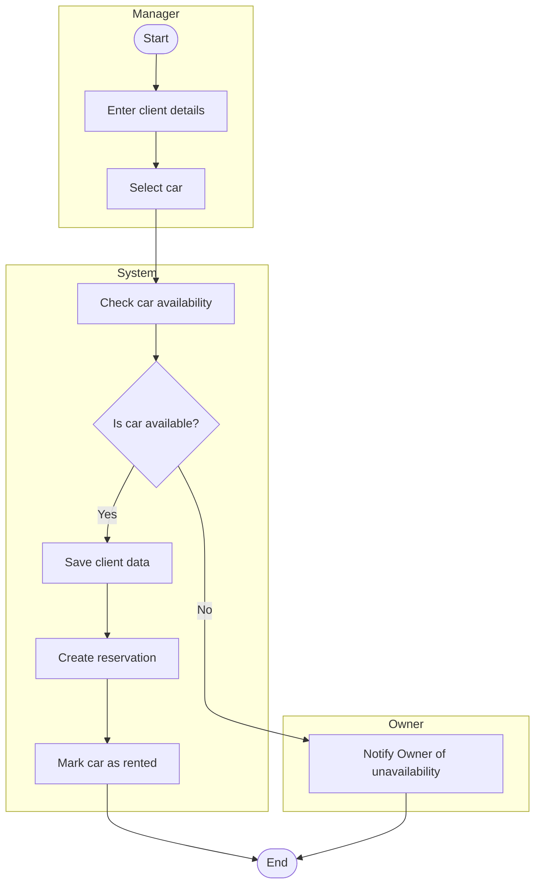

```mermaid
flowchart TD
    subgraph Manager
        A1([Start]) --> A2[Enter client details]
        A2 --> A3[Select car]
    end

    subgraph System
        B1[Check car availability]
        B2{Is car available?}
        B3[Save client data]
        B4[Create reservation]
        B5[Mark car as rented]
    end

    subgraph Owner
        C1[Notify Owner of unavailability]
    end

    A3 --> B1 --> B2
    B2 -- Yes --> B3 --> B4 --> B5 --> A4([End])
    B2 -- No --> C1 --> A4
```
