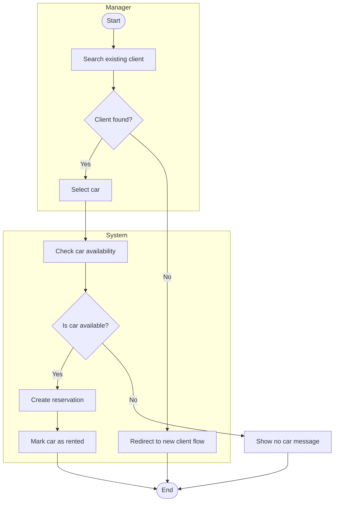

```mermaid
flowchart TD
    subgraph Manager
        A1([Start]) --> A2[Search existing client]
        A2 --> A3{Client found?}
        A4[Select car]
    end

    subgraph System
        B1[Check car availability]
        B2{Is car available?}
        B3[Create reservation]
        B4[Mark car as rented]
        B5[Redirect to new client flow]
    end

    A3 -- Yes --> A4 --> B1 --> B2
    B2 -- Yes --> B3 --> B4 --> A5([End])
    B2 -- No --> A6[Show no car message] --> A5
    A3 -- No --> B5 --> A5
```
