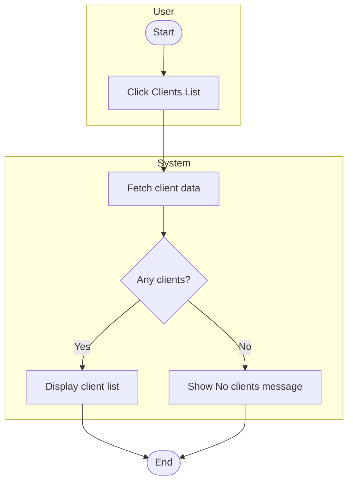

```mermaid
flowchart TD
    subgraph User
        A1([Start]) --> A2[Click Clients List]
    end

    subgraph System
        B1[Fetch client data]
        B2{Any clients?}
        B3[Display client list]
        B4[Show No clients message]
    end

    A2 --> B1 --> B2
    B2 -- Yes --> B3 --> A3([End])
    B2 -- No --> B4 --> A3
```
