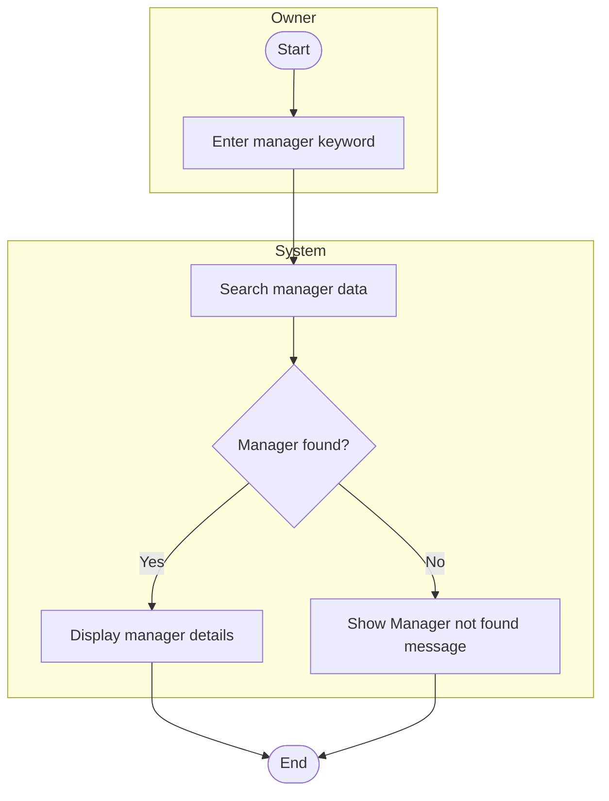

```mermaid
flowchart TD
    subgraph Owner
        A1([Start]) --> A2[Enter manager keyword]
    end

    subgraph System
        B1[Search manager data]
        B2{Manager found?}
        B3[Display manager details]
        B4[Show Manager not found message]
    end

    A2 --> B1 --> B2
    B2 -- Yes --> B3 --> A3([End])
    B2 -- No --> B4 --> A3
```
