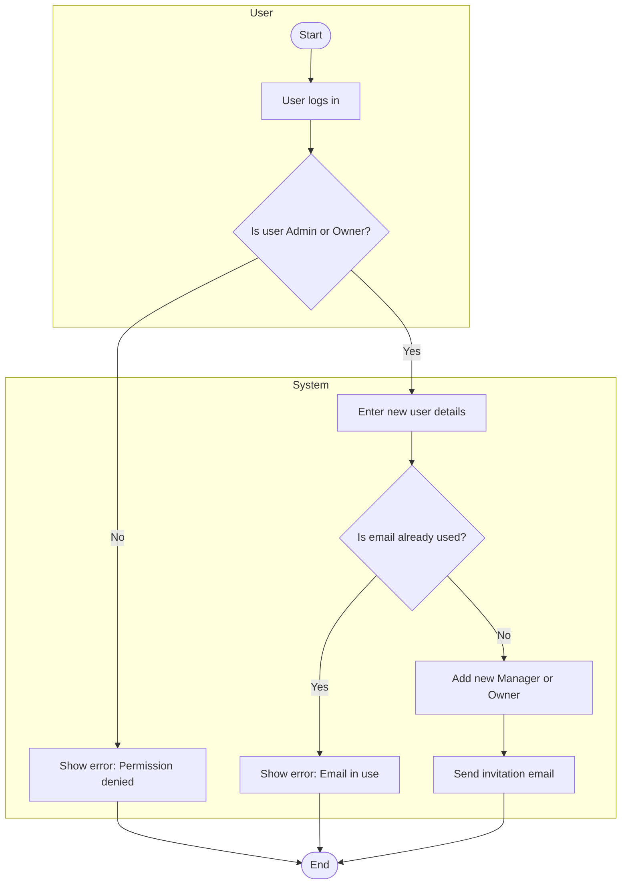

```mermaid
flowchart TD
    subgraph User
        A1([Start]) --> A2[User logs in]
        A2 --> A3{Is user Admin or Owner?}
    end

    subgraph System
        B1[Show error: Permission denied]
        B2[Enter new user details]
        B3{Is email already used?}
        B4[Show error: Email in use]
        B5[Add new Manager or Owner]
        B6[Send invitation email]
    end

    A3 -- No --> B1 --> A4([End])
    A3 -- Yes --> B2 --> B3
    B3 -- Yes --> B4 --> A4
    B3 -- No --> B5 --> B6 --> A4
```
