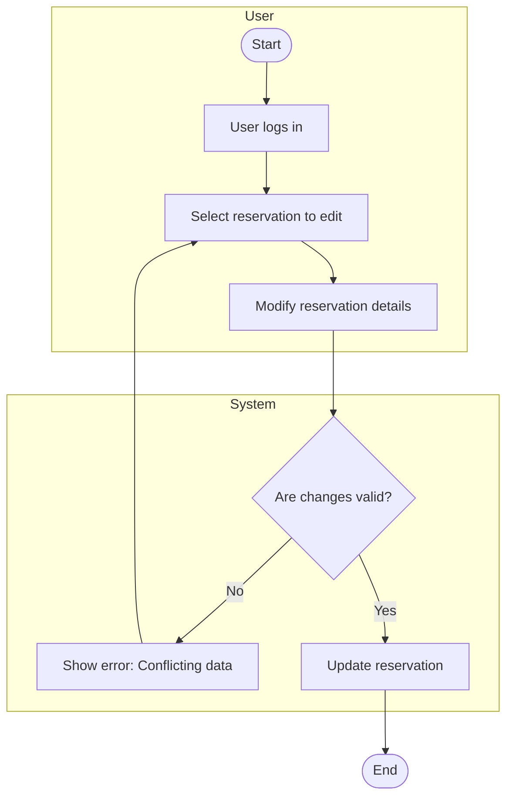

```mermaid
flowchart TD
    subgraph User
        A1([Start]) --> A2[User logs in]
        A2 --> A3[Select reservation to edit]
        A3 --> A4[Modify reservation details]
    end

    subgraph System
        B1{Are changes valid?}
        B2[Show error: Conflicting data]
        B3[Update reservation]
    end

    A4 --> B1
    B1 -- No --> B2 --> A3
    B1 -- Yes --> B3 --> A5([End])
```
