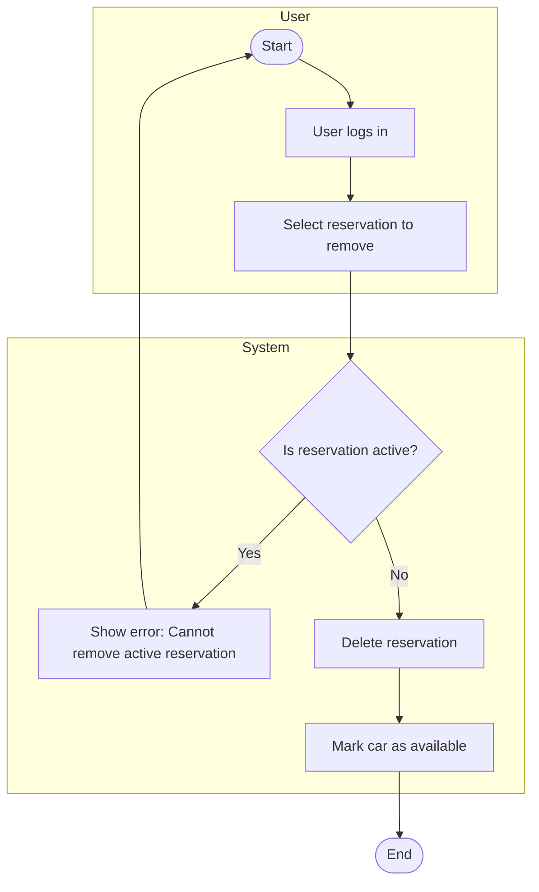

```mermaid
flowchart TD
    subgraph User
        A1([Start]) --> A2[User logs in]
        A2 --> A3[Select reservation to remove]
    end

    subgraph System
        B1{Is reservation active?}
        B2[Show error: Cannot remove active reservation]
        B3[Delete reservation]
        B4[Mark car as available]
    end

    A3 --> B1
    B1 -- Yes --> B2 --> A1
    B1 -- No --> B3 --> B4 --> A4([End])
```
