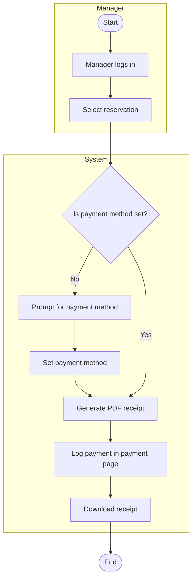

```mermaid
flowchart TD
    subgraph Manager
        A1([Start]) --> A2[Manager logs in]
        A2 --> A3[Select reservation]
    end

    subgraph System
        B1{Is payment method set?}
        B2[Prompt for payment method]
        B3[Set payment method]
        B4[Generate PDF receipt]
        B5[Log payment in payment page]
        B6[Download receipt]
    end

    A3 --> B1
    B1 -- No --> B2 --> B3 --> B4
    B1 -- Yes --> B4
    B4 --> B5 --> B6 --> A4([End])
```
