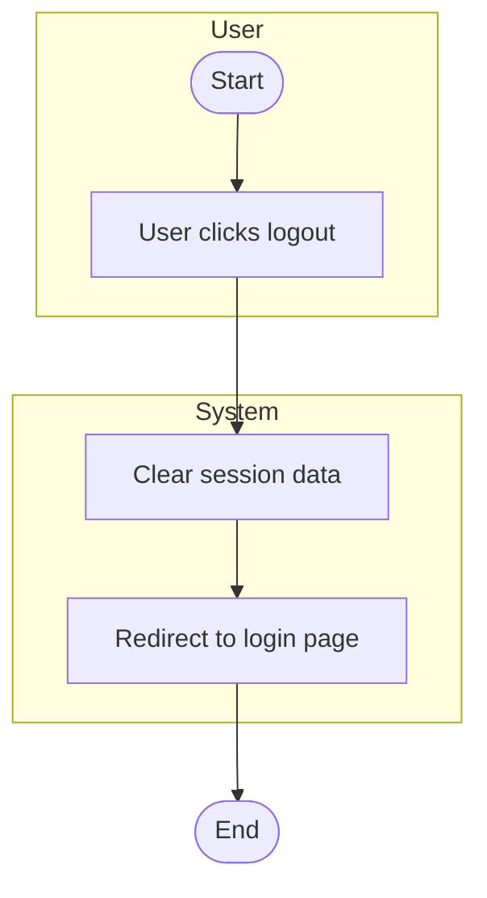

```mermaid
flowchart TD
    subgraph User
        A1([Start]) --> A2[User clicks logout]
    end

    subgraph System
        B1[Clear session data]
        B2[Redirect to login page]
    end

    A2 --> B1 --> B2 --> A3([End])
```
