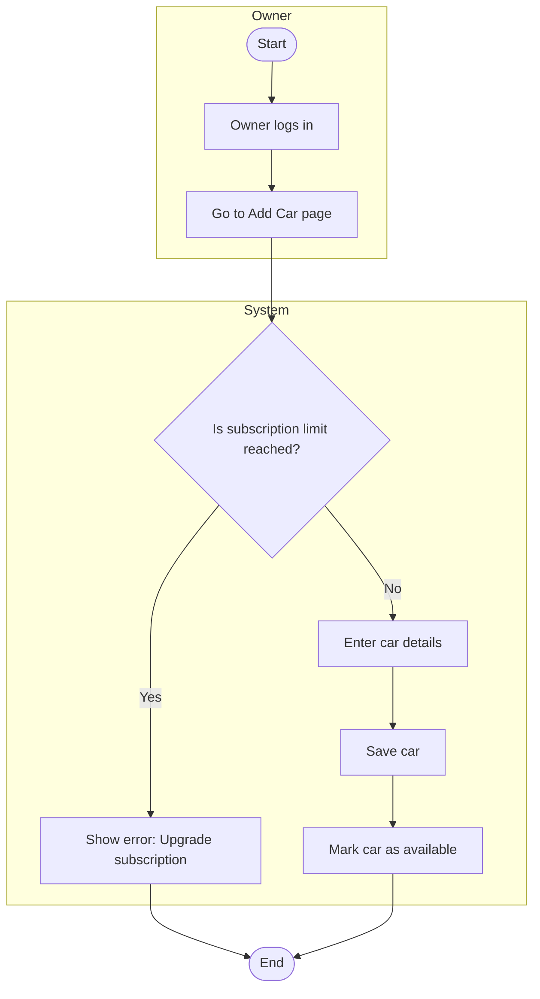

```mermaid
flowchart TD
    subgraph Owner
        A1([Start]) --> A2[Owner logs in]
        A2 --> A3[Go to Add Car page]
    end

    subgraph System
        B1{Is subscription limit reached?}
        B2[Show error: Upgrade subscription]
        B3[Enter car details]
        B4[Save car]
        B5[Mark car as available]
    end

    A3 --> B1
    B1 -- Yes --> B2 --> A4([End])
    B1 -- No --> B3 --> B4 --> B5 --> A4
```
