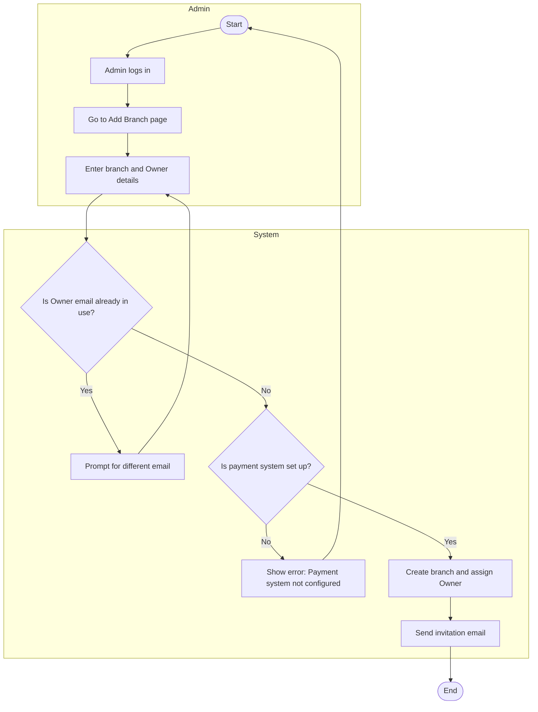

```mermaid
flowchart TD
    subgraph Admin
        A1([Start]) --> A2[Admin logs in]
        A2 --> A3[Go to Add Branch page]
        A3 --> A4[Enter branch and Owner details]
    end

    subgraph System
        B1{Is Owner email already in use?}
        B2[Prompt for different email]
        B3{Is payment system set up?}
        B4[Show error: Payment system not configured]
        B5[Create branch and assign Owner]
        B6[Send invitation email]
    end

    A4 --> B1
    B1 -- Yes --> B2 --> A4
    B1 -- No --> B3
    B3 -- No --> B4 --> A1
    B3 -- Yes --> B5 --> B6 --> A5([End])
```
