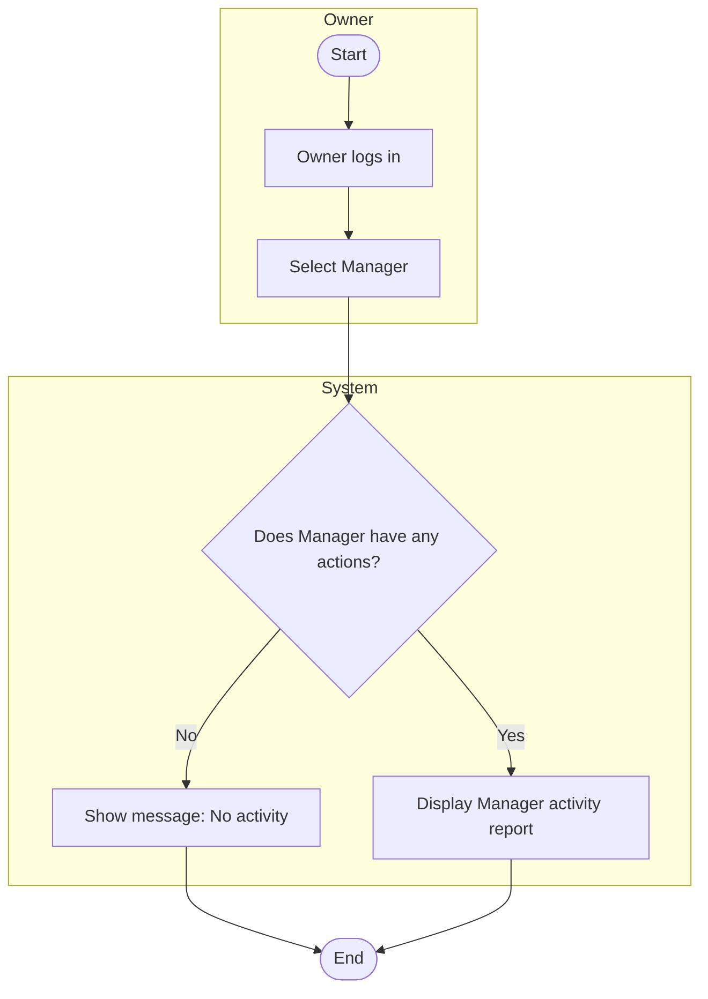

```mermaid
flowchart TD
    subgraph Owner
        A1([Start]) --> A2[Owner logs in]
        A2 --> A3[Select Manager]
    end

    subgraph System
        B1{Does Manager have any actions?}
        B2[Show message: No activity]
        B3[Display Manager activity report]
    end

    A3 --> B1
    B1 -- No --> B2 --> A4([End])
    B1 -- Yes --> B3 --> A4
```
