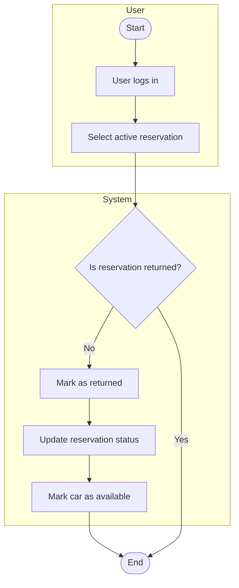

```mermaid
flowchart TD
    subgraph User
        A1([Start]) --> A2[User logs in]
        A2 --> A3[Select active reservation]
    end

    subgraph System
        B1{Is reservation returned?}
        B2[Mark as returned]
        B3[Update reservation status]
        B4[Mark car as available]
    end

    A3 --> B1
    B1 -- No --> B2 --> B3 --> B4 --> A4([End])
    B1 -- Yes --> A4
```
