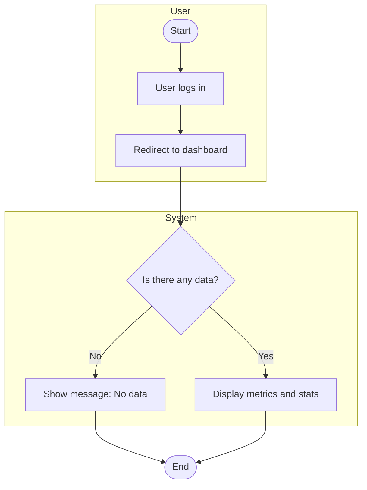

```mermaid
flowchart TD
    subgraph User
        A1([Start]) --> A2[User logs in]
        A2 --> A3[Redirect to dashboard]
    end

    subgraph System
        B1{Is there any data?}
        B2[Show message: No data]
        B3[Display metrics and stats]
    end

    A3 --> B1
    B1 -- No --> B2 --> A4([End])
    B1 -- Yes --> B3 --> A4
```
