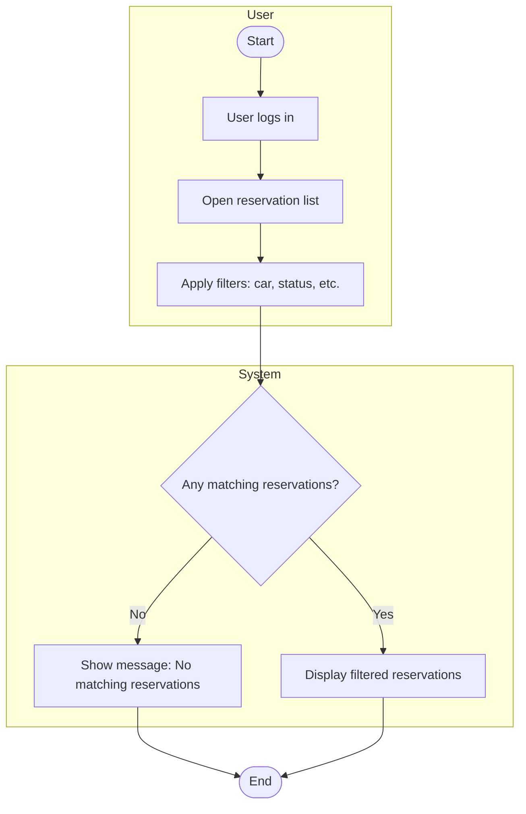

```mermaid
flowchart TD
    subgraph User
        A1([Start]) --> A2[User logs in]
        A2 --> A3[Open reservation list]
        A3 --> A4[Apply filters: car, status, etc.]
    end

    subgraph System
        B1{Any matching reservations?}
        B2[Show message: No matching reservations]
        B3[Display filtered reservations]
    end

    A4 --> B1
    B1 -- No --> B2 --> A5([End])
    B1 -- Yes --> B3 --> A5
```
