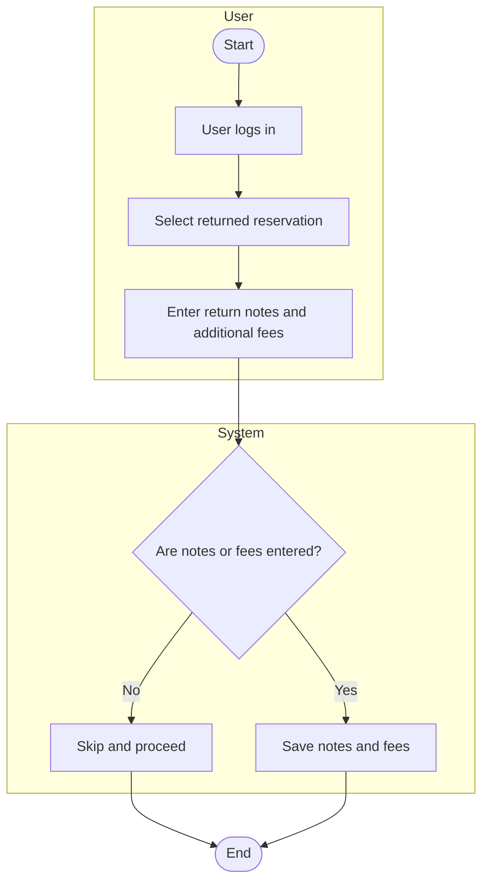

```mermaid
flowchart TD
    subgraph User
        A1([Start]) --> A2[User logs in]
        A2 --> A3[Select returned reservation]
        A3 --> A4[Enter return notes and additional fees]
    end

    subgraph System
        B1{Are notes or fees entered?}
        B2[Skip and proceed]
        B3[Save notes and fees]
    end

    A4 --> B1
    B1 -- No --> B2 --> A5([End])
    B1 -- Yes --> B3 --> A5
```
