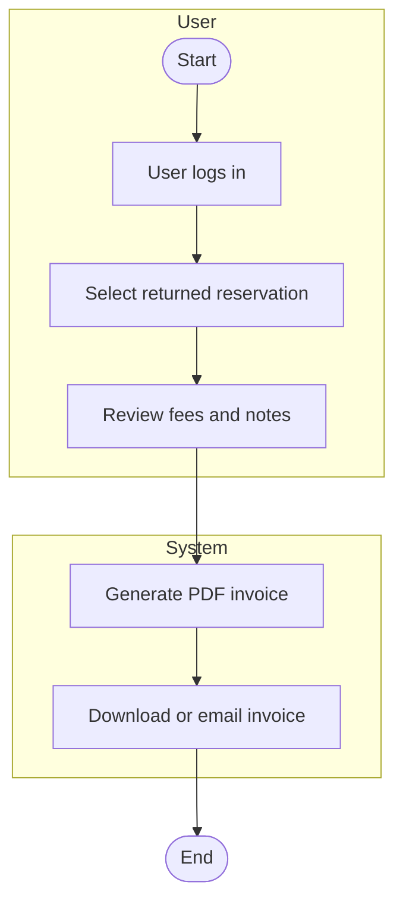

```mermaid
flowchart TD
    subgraph User
        A1([Start]) --> A2[User logs in]
        A2 --> A3[Select returned reservation]
        A3 --> A4[Review fees and notes]
    end

    subgraph System
        B1[Generate PDF invoice]
        B2[Download or email invoice]
    end

    A4 --> B1 --> B2 --> A5([End])
```
