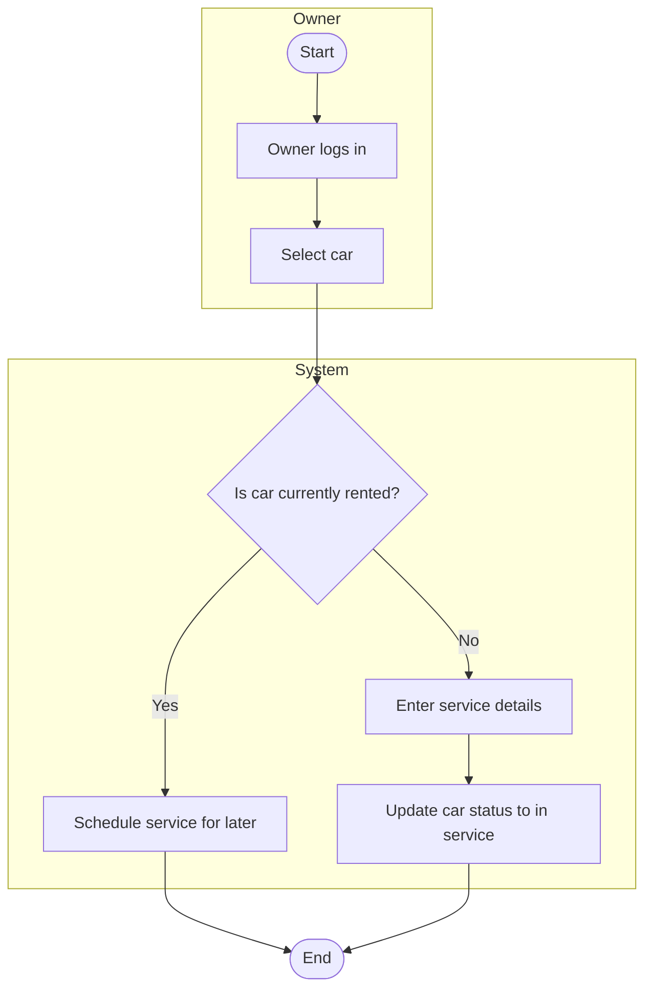

```mermaid
flowchart TD
    subgraph Owner
        A1([Start]) --> A2[Owner logs in]
        A2 --> A3[Select car]
    end

    subgraph System
        B1{Is car currently rented?}
        B2[Schedule service for later]
        B3[Enter service details]
        B4[Update car status to in service]
    end

    A3 --> B1
    B1 -- Yes --> B2 --> A4([End])
    B1 -- No --> B3 --> B4 --> A4
```
