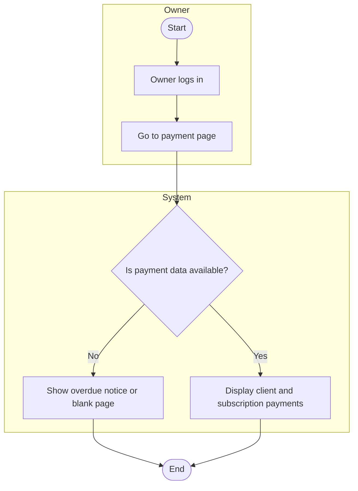

```mermaid
flowchart TD
    subgraph Owner
        A1([Start]) --> A2[Owner logs in]
        A2 --> A3[Go to payment page]
    end

    subgraph System
        B1{Is payment data available?}
        B2[Show overdue notice or blank page]
        B3[Display client and subscription payments]
    end

    A3 --> B1
    B1 -- No --> B2 --> A4([End])
    B1 -- Yes --> B3 --> A4
```
