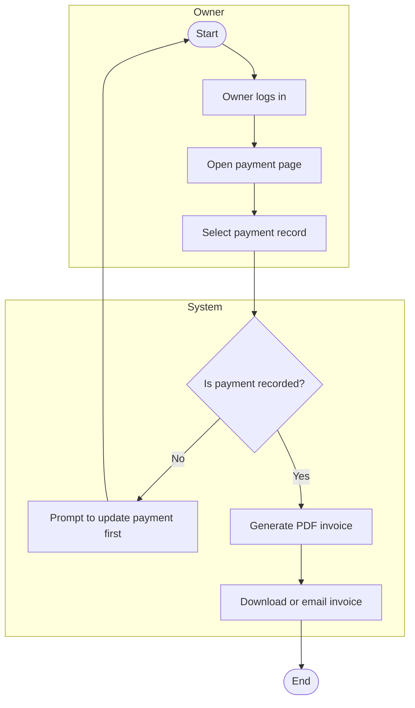

```mermaid
flowchart TD
    subgraph Owner
        A1([Start]) --> A2[Owner logs in]
        A2 --> A3[Open payment page]
        A3 --> A4[Select payment record]
    end

    subgraph System
        B1{Is payment recorded?}
        B2[Prompt to update payment first]
        B3[Generate PDF invoice]
        B4[Download or email invoice]
    end

    A4 --> B1
    B1 -- No --> B2 --> A1
    B1 -- Yes --> B3 --> B4 --> A5([End])
```
