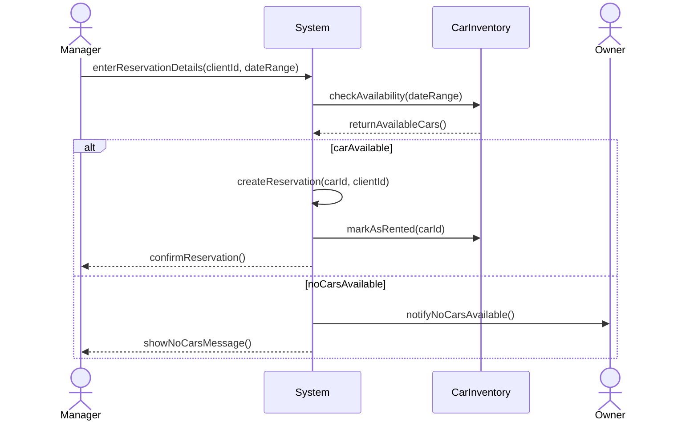

```mermaid
sequenceDiagram
    actor Manager
    participant System
    participant CarInventory
    actor Owner

    Manager->>System: enterReservationDetails(clientId, dateRange)
    System->>CarInventory: checkAvailability(dateRange)
    CarInventory-->>System: returnAvailableCars()

    alt carAvailable
        System->>System: createReservation(carId, clientId)
        System->>CarInventory: markAsRented(carId)
        System-->>Manager: confirmReservation()
    else noCarsAvailable
        System->>Owner: notifyNoCarsAvailable()
        System-->>Manager: showNoCarsMessage()
    end
```
