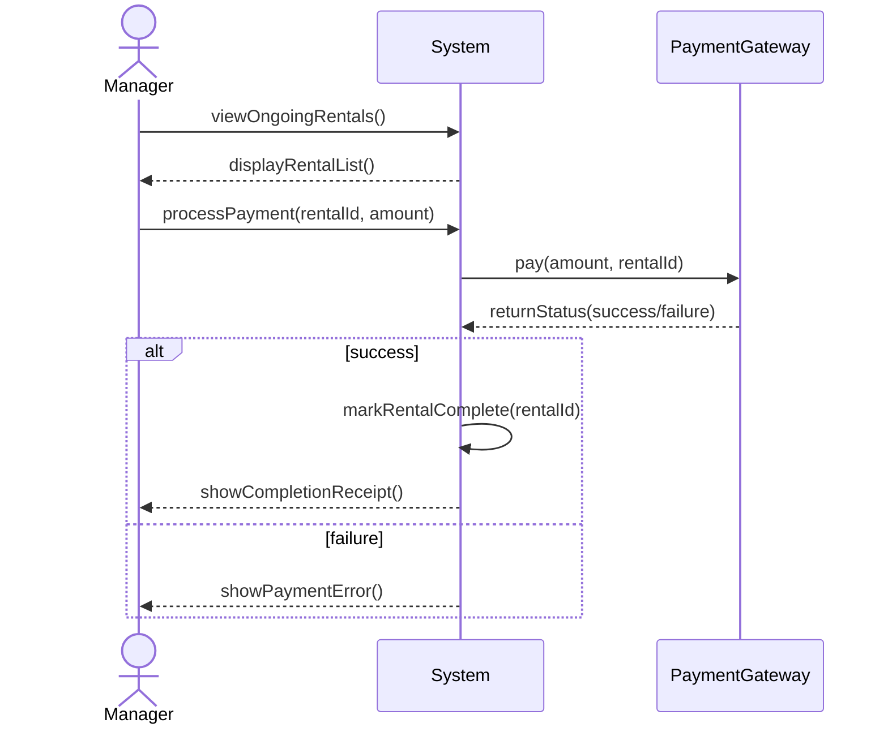

```mermaid
sequenceDiagram
    actor Manager
    participant System
    participant PaymentGateway

    Manager->>System: viewOngoingRentals()
    System-->>Manager: displayRentalList()

    Manager->>System: processPayment(rentalId, amount)
    System->>PaymentGateway: pay(amount, rentalId)
    PaymentGateway-->>System: returnStatus(success/failure)

    alt success
        System->>System: markRentalComplete(rentalId)
        System-->>Manager: showCompletionReceipt()
    else failure
        System-->>Manager: showPaymentError()
    end
```
