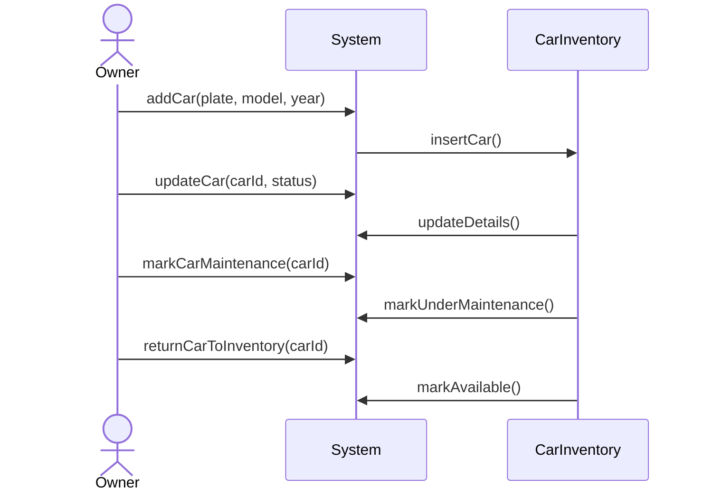

```mermaid
sequenceDiagram
    actor Owner
    participant System
    participant CarInventory

    Owner->>System: addCar(plate, model, year)
    System->>CarInventory: insertCar()

    Owner->>System: updateCar(carId, status)
    CarInventory->>System: updateDetails()

    Owner->>System: markCarMaintenance(carId)
    CarInventory->>System: markUnderMaintenance()

    Owner->>System: returnCarToInventory(carId)
    CarInventory->>System: markAvailable()
```
