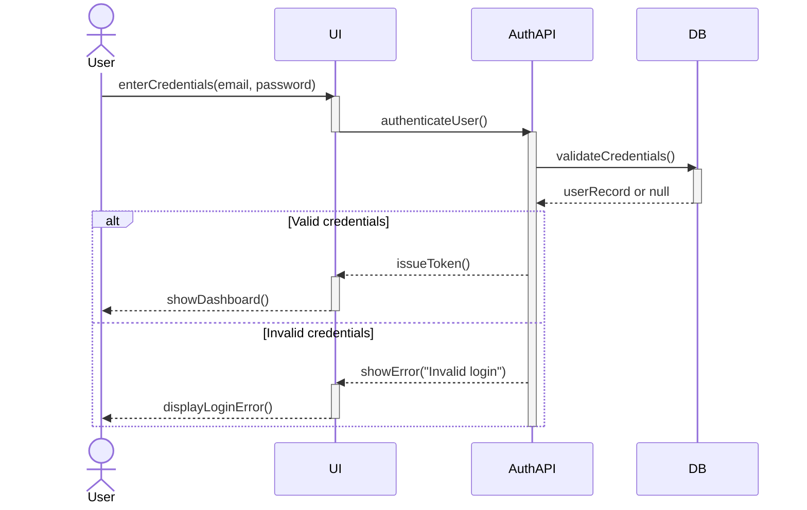

```mermaid
sequenceDiagram
    actor User
    participant UI
    participant AuthAPI
    participant DB

    User->>UI: enterCredentials(email, password)
    activate UI
    UI->>AuthAPI: authenticateUser()
    deactivate UI

    activate AuthAPI
    AuthAPI->>DB: validateCredentials()
    activate DB
    DB-->>AuthAPI: userRecord or null
    deactivate DB

    alt Valid credentials
        AuthAPI-->>UI: issueToken()
        activate UI
        UI-->>User: showDashboard()
        deactivate UI
    else Invalid credentials
        AuthAPI-->>UI: showError("Invalid login")
        activate UI
        UI-->>User: displayLoginError()
        deactivate UI
    end
    deactivate AuthAPI
```
