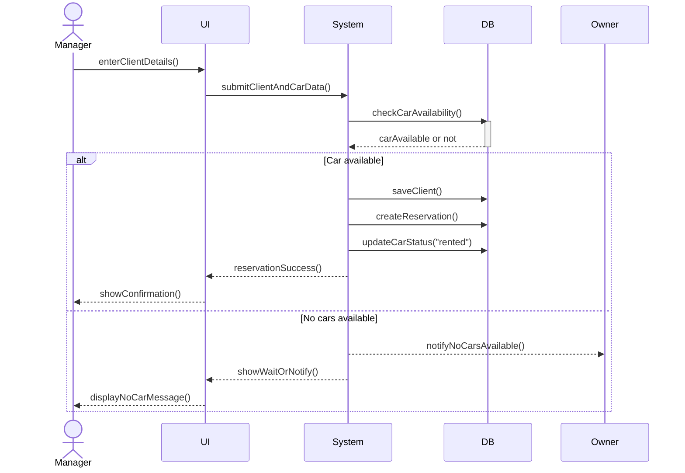

```mermaid
sequenceDiagram
    actor Manager
    participant UI
    participant System
    participant DB
    participant Owner

    Manager->>UI: enterClientDetails()
    UI->>System: submitClientAndCarData()
    System->>DB: checkCarAvailability()
    activate DB
    DB-->>System: carAvailable or not
    deactivate DB

    alt Car available
        System->>DB: saveClient()
        System->>DB: createReservation()
        System->>DB: updateCarStatus("rented")
        System-->>UI: reservationSuccess()
        UI-->>Manager: showConfirmation()
    else No cars available
        System-->>Owner: notifyNoCarsAvailable()
        System-->>UI: showWaitOrNotify()
        UI-->>Manager: displayNoCarMessage()
    end
```
