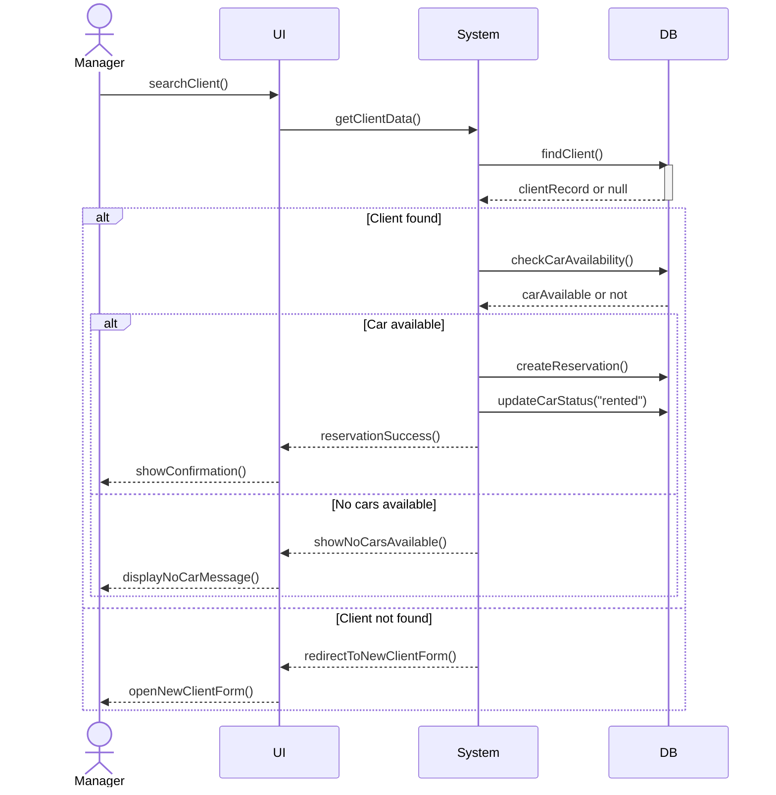

```mermaid
sequenceDiagram
    actor Manager
    participant UI
    participant System
    participant DB

    Manager->>UI: searchClient()
    UI->>System: getClientData()
    System->>DB: findClient()
    activate DB
    DB-->>System: clientRecord or null
    deactivate DB

    alt Client found
        System->>DB: checkCarAvailability()
        DB-->>System: carAvailable or not

        alt Car available
            System->>DB: createReservation()
            System->>DB: updateCarStatus("rented")
            System-->>UI: reservationSuccess()
            UI-->>Manager: showConfirmation()
        else No cars available
            System-->>UI: showNoCarsAvailable()
            UI-->>Manager: displayNoCarMessage()
        end
    else Client not found
        System-->>UI: redirectToNewClientForm()
        UI-->>Manager: openNewClientForm()
    end
```
