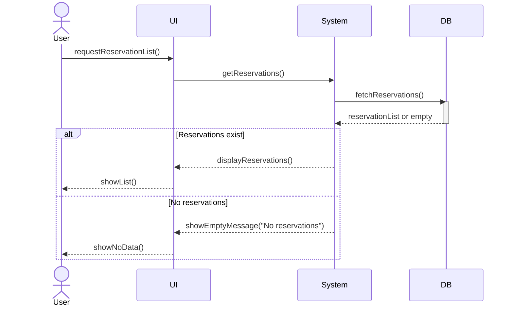

```mermaid
sequenceDiagram
    actor User
    participant UI
    participant System
    participant DB

    User->>UI: requestReservationList()
    UI->>System: getReservations()
    System->>DB: fetchReservations()
    activate DB
    DB-->>System: reservationList or empty
    deactivate DB

    alt Reservations exist
        System-->>UI: displayReservations()
        UI-->>User: showList()
    else No reservations
        System-->>UI: showEmptyMessage("No reservations")
        UI-->>User: showNoData()
    end
```
