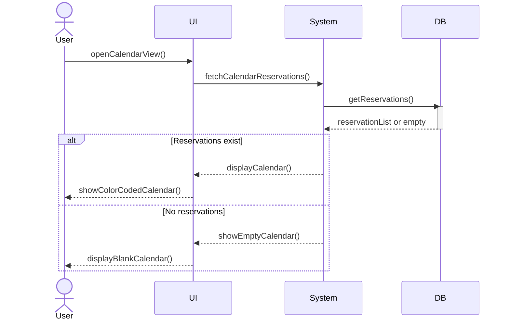

```mermaid
sequenceDiagram
    actor User
    participant UI
    participant System
    participant DB

    User->>UI: openCalendarView()
    UI->>System: fetchCalendarReservations()
    System->>DB: getReservations()
    activate DB
    DB-->>System: reservationList or empty
    deactivate DB

    alt Reservations exist
        System-->>UI: displayCalendar()
        UI-->>User: showColorCodedCalendar()
    else No reservations
        System-->>UI: showEmptyCalendar()
        UI-->>User: displayBlankCalendar()
    end
```
