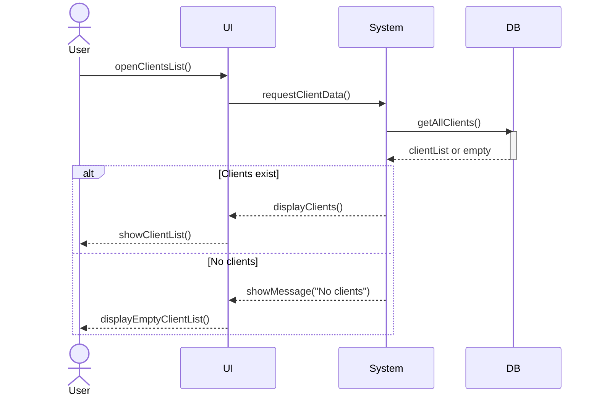

```mermaid
sequenceDiagram
    actor User
    participant UI
    participant System
    participant DB

    User->>UI: openClientsList()
    UI->>System: requestClientData()
    System->>DB: getAllClients()
    activate DB
    DB-->>System: clientList or empty
    deactivate DB

    alt Clients exist
        System-->>UI: displayClients()
        UI-->>User: showClientList()
    else No clients
        System-->>UI: showMessage("No clients")
        UI-->>User: displayEmptyClientList()
    end
```
