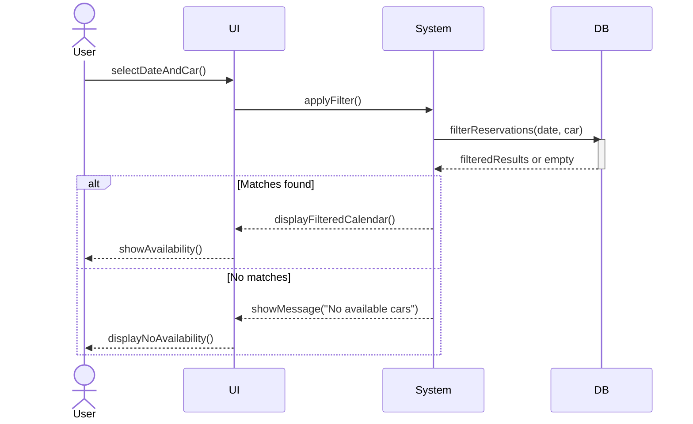

```mermaid
sequenceDiagram
    actor User
    participant UI
    participant System
    participant DB

    User->>UI: selectDateAndCar()
    UI->>System: applyFilter()
    System->>DB: filterReservations(date, car)
    activate DB
    DB-->>System: filteredResults or empty
    deactivate DB

    alt Matches found
        System-->>UI: displayFilteredCalendar()
        UI-->>User: showAvailability()
    else No matches
        System-->>UI: showMessage("No available cars")
        UI-->>User: displayNoAvailability()
    end
```
