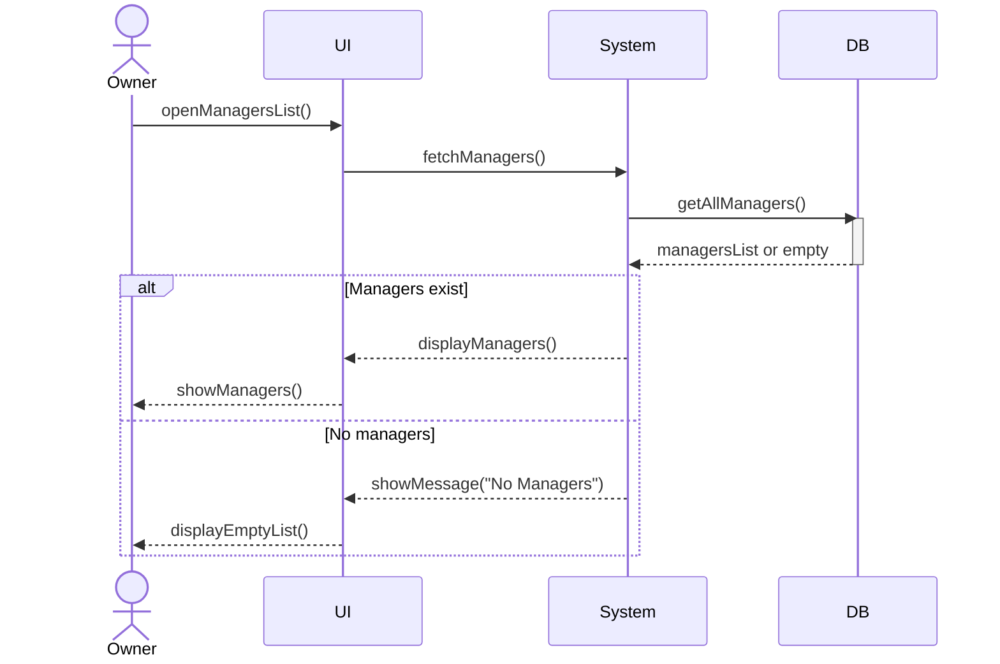

```mermaid
sequenceDiagram
    actor Owner
    participant UI
    participant System
    participant DB

    Owner->>UI: openManagersList()
    UI->>System: fetchManagers()
    System->>DB: getAllManagers()
    activate DB
    DB-->>System: managersList or empty
    deactivate DB

    alt Managers exist
        System-->>UI: displayManagers()
        UI-->>Owner: showManagers()
    else No managers
        System-->>UI: showMessage("No Managers")
        UI-->>Owner: displayEmptyList()
    end
```
