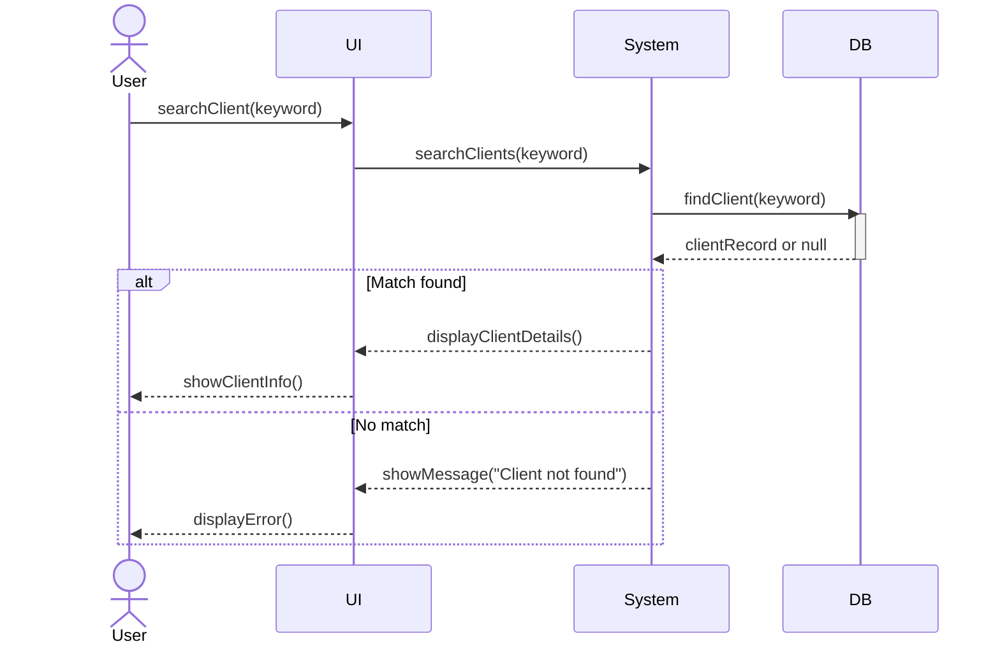

```mermaid
sequenceDiagram
    actor User
    participant UI
    participant System
    participant DB

    User->>UI: searchClient(keyword)
    UI->>System: searchClients(keyword)
    System->>DB: findClient(keyword)
    activate DB
    DB-->>System: clientRecord or null
    deactivate DB

    alt Match found
        System-->>UI: displayClientDetails()
        UI-->>User: showClientInfo()
    else No match
        System-->>UI: showMessage("Client not found")
        UI-->>User: displayError()
    end
```
