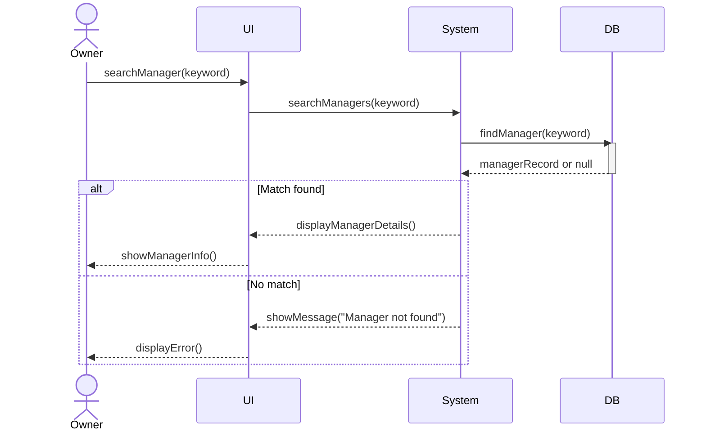

```mermaid
sequenceDiagram
    actor Owner
    participant UI
    participant System
    participant DB

    Owner->>UI: searchManager(keyword)
    UI->>System: searchManagers(keyword)
    System->>DB: findManager(keyword)
    activate DB
    DB-->>System: managerRecord or null
    deactivate DB

    alt Match found
        System-->>UI: displayManagerDetails()
        UI-->>Owner: showManagerInfo()
    else No match
        System-->>UI: showMessage("Manager not found")
        UI-->>Owner: displayError()
    end
```
