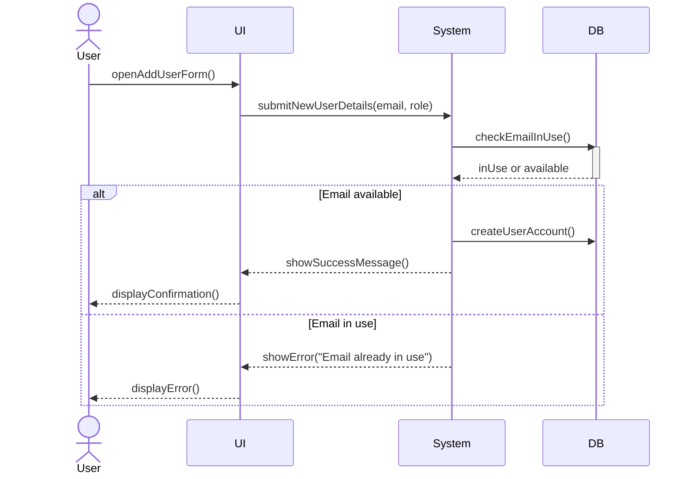

```mermaid
sequenceDiagram
    actor User
    participant UI
    participant System
    participant DB

    User->>UI: openAddUserForm()
    UI->>System: submitNewUserDetails(email, role)
    System->>DB: checkEmailInUse()
    activate DB
    DB-->>System: inUse or available
    deactivate DB

    alt Email available
        System->>DB: createUserAccount()
        System-->>UI: showSuccessMessage()
        UI-->>User: displayConfirmation()
    else Email in use
        System-->>UI: showError("Email already in use")
        UI-->>User: displayError()
    end
```
