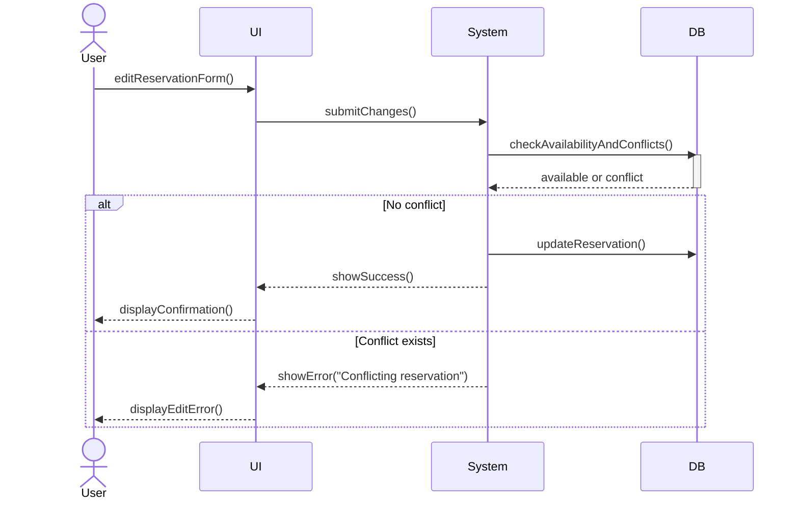

```mermaid
sequenceDiagram
    actor User
    participant UI
    participant System
    participant DB

    User->>UI: editReservationForm()
    UI->>System: submitChanges()
    System->>DB: checkAvailabilityAndConflicts()
    activate DB
    DB-->>System: available or conflict
    deactivate DB

    alt No conflict
        System->>DB: updateReservation()
        System-->>UI: showSuccess()
        UI-->>User: displayConfirmation()
    else Conflict exists
        System-->>UI: showError("Conflicting reservation")
        UI-->>User: displayEditError()
    end
```
