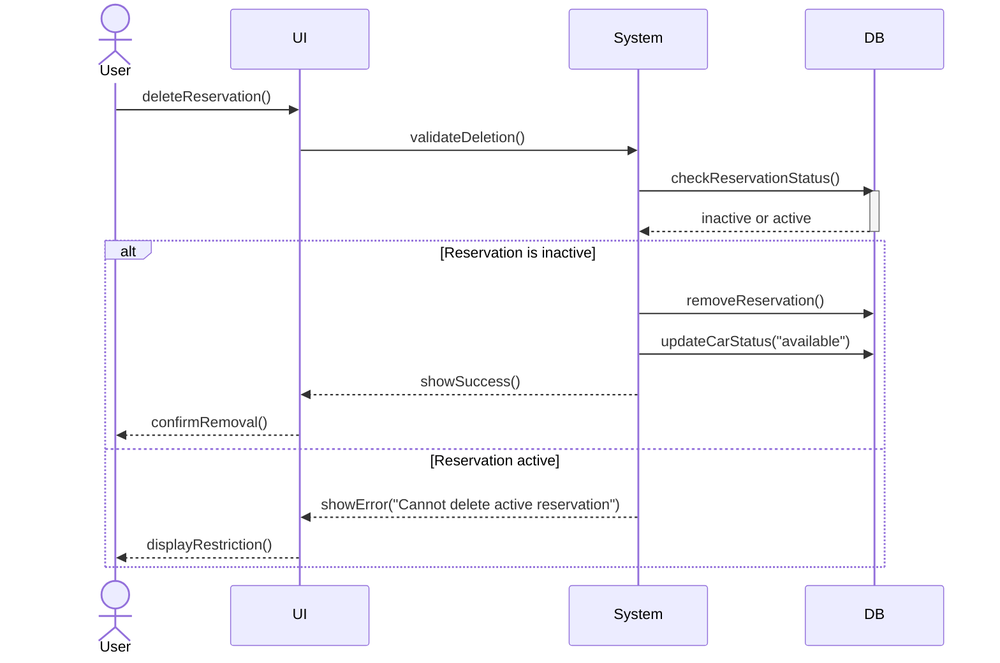

```mermaid
sequenceDiagram
    actor User
    participant UI
    participant System
    participant DB

    User->>UI: deleteReservation()
    UI->>System: validateDeletion()
    System->>DB: checkReservationStatus()
    activate DB
    DB-->>System: inactive or active
    deactivate DB

    alt Reservation is inactive
        System->>DB: removeReservation()
        System->>DB: updateCarStatus("available")
        System-->>UI: showSuccess()
        UI-->>User: confirmRemoval()
    else Reservation active
        System-->>UI: showError("Cannot delete active reservation")
        UI-->>User: displayRestriction()
    end
```
