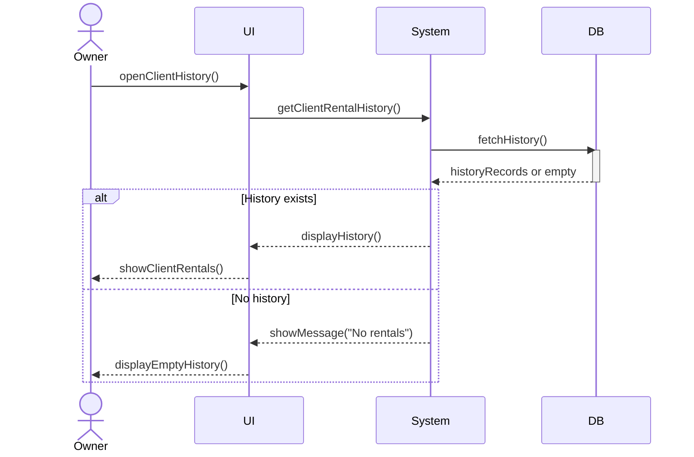

```mermaid
sequenceDiagram
    actor Owner
    participant UI
    participant System
    participant DB

    Owner->>UI: openClientHistory()
    UI->>System: getClientRentalHistory()
    System->>DB: fetchHistory()
    activate DB
    DB-->>System: historyRecords or empty
    deactivate DB

    alt History exists
        System-->>UI: displayHistory()
        UI-->>Owner: showClientRentals()
    else No history
        System-->>UI: showMessage("No rentals")
        UI-->>Owner: displayEmptyHistory()
    end
```
