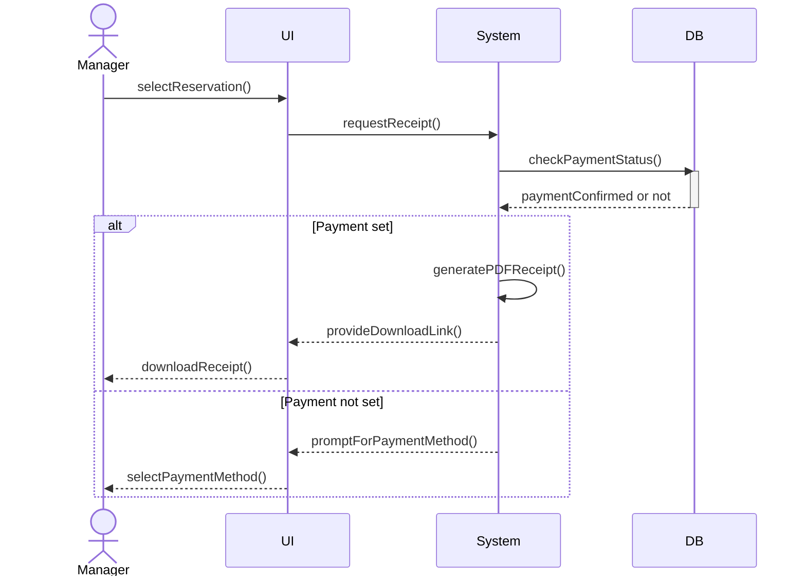

```mermaid
sequenceDiagram
    actor Manager
    participant UI
    participant System
    participant DB

    Manager->>UI: selectReservation()
    UI->>System: requestReceipt()
    System->>DB: checkPaymentStatus()
    activate DB
    DB-->>System: paymentConfirmed or not
    deactivate DB

    alt Payment set
        System->>System: generatePDFReceipt()
        System-->>UI: provideDownloadLink()
        UI-->>Manager: downloadReceipt()
    else Payment not set
        System-->>UI: promptForPaymentMethod()
        UI-->>Manager: selectPaymentMethod()
    end
```
