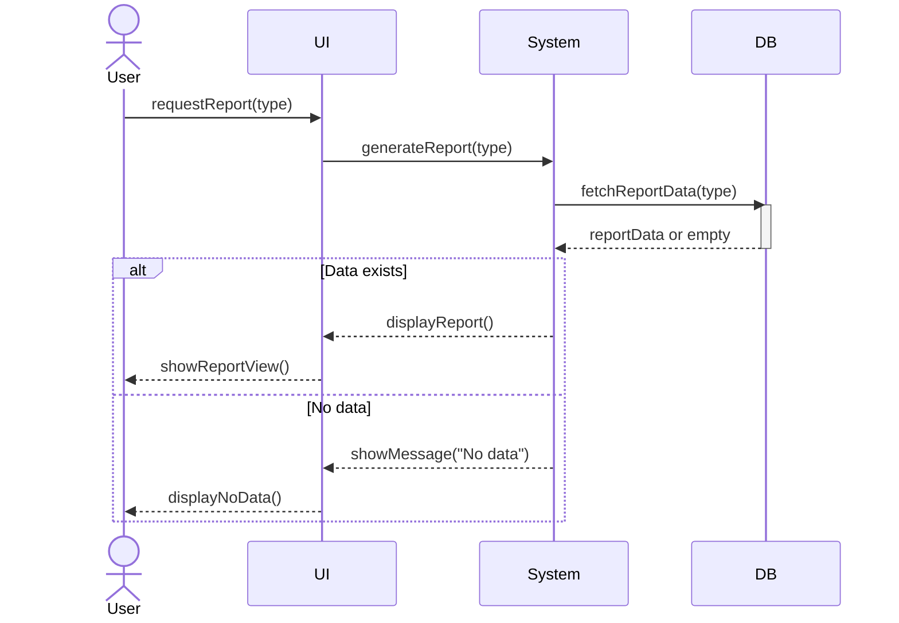

```mermaid
sequenceDiagram
    actor User
    participant UI
    participant System
    participant DB

    User->>UI: requestReport(type)
    UI->>System: generateReport(type)
    System->>DB: fetchReportData(type)
    activate DB
    DB-->>System: reportData or empty
    deactivate DB

    alt Data exists
        System-->>UI: displayReport()
        UI-->>User: showReportView()
    else No data
        System-->>UI: showMessage("No data")
        UI-->>User: displayNoData()
    end
```
