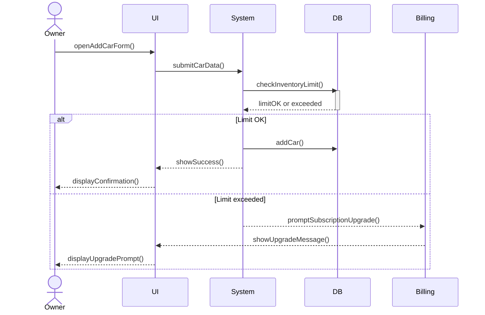

```mermaid
sequenceDiagram
    actor Owner
    participant UI
    participant System
    participant DB
    participant Billing

    Owner->>UI: openAddCarForm()
    UI->>System: submitCarData()
    System->>DB: checkInventoryLimit()
    activate DB
    DB-->>System: limitOK or exceeded
    deactivate DB

    alt Limit OK
        System->>DB: addCar()
        System-->>UI: showSuccess()
        UI-->>Owner: displayConfirmation()
    else Limit exceeded
        System-->>Billing: promptSubscriptionUpgrade()
        Billing-->>UI: showUpgradeMessage()
        UI-->>Owner: displayUpgradePrompt()
    end
```
