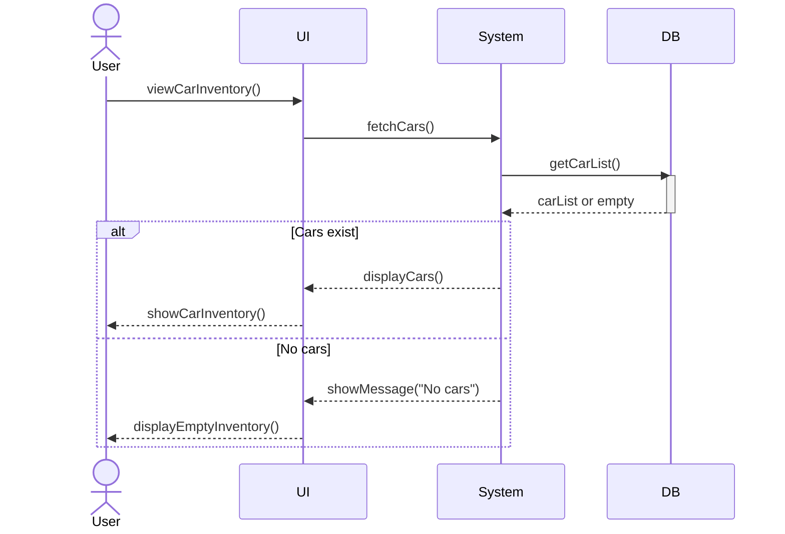

```mermaid
sequenceDiagram
    actor User
    participant UI
    participant System
    participant DB

    User->>UI: viewCarInventory()
    UI->>System: fetchCars()
    System->>DB: getCarList()
    activate DB
    DB-->>System: carList or empty
    deactivate DB

    alt Cars exist
        System-->>UI: displayCars()
        UI-->>User: showCarInventory()
    else No cars
        System-->>UI: showMessage("No cars")
        UI-->>User: displayEmptyInventory()
    end
```
