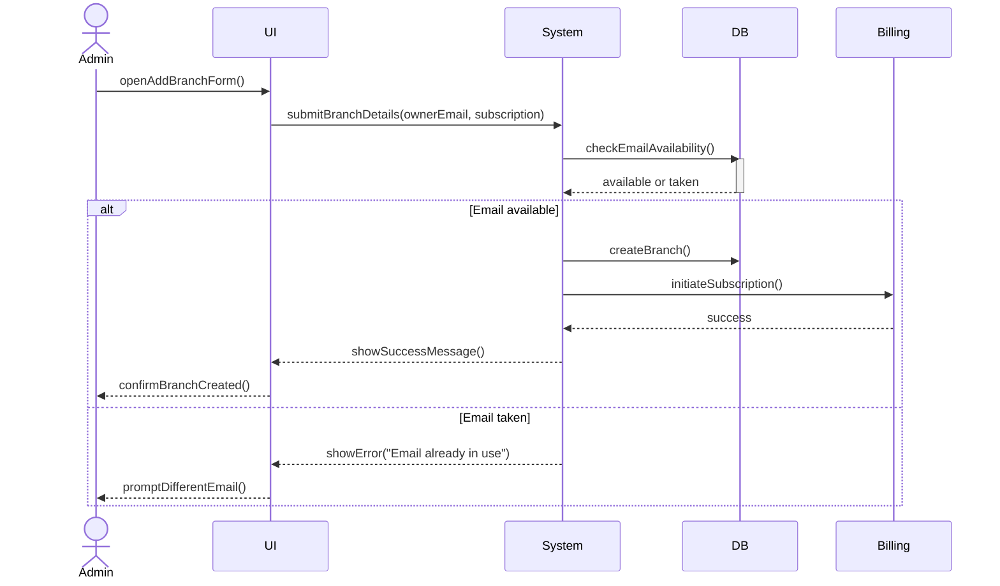

```mermaid
sequenceDiagram
    actor Admin
    participant UI
    participant System
    participant DB
    participant Billing

    Admin->>UI: openAddBranchForm()
    UI->>System: submitBranchDetails(ownerEmail, subscription)
    System->>DB: checkEmailAvailability()
    activate DB
    DB-->>System: available or taken
    deactivate DB

    alt Email available
        System->>DB: createBranch()
        System->>Billing: initiateSubscription()
        Billing-->>System: success
        System-->>UI: showSuccessMessage()
        UI-->>Admin: confirmBranchCreated()
    else Email taken
        System-->>UI: showError("Email already in use")
        UI-->>Admin: promptDifferentEmail()
    end
```
