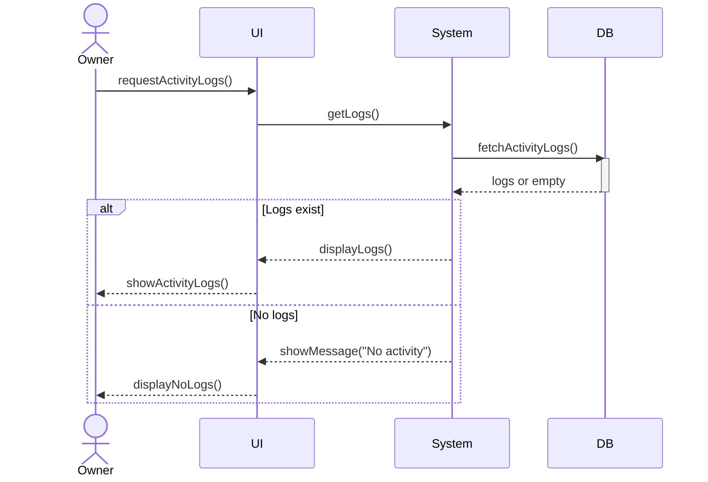

```mermaid
sequenceDiagram
    actor Owner
    participant UI
    participant System
    participant DB

    Owner->>UI: requestActivityLogs()
    UI->>System: getLogs()
    System->>DB: fetchActivityLogs()
    activate DB
    DB-->>System: logs or empty
    deactivate DB

    alt Logs exist
        System-->>UI: displayLogs()
        UI-->>Owner: showActivityLogs()
    else No logs
        System-->>UI: showMessage("No activity")
        UI-->>Owner: displayNoLogs()
    end
```
