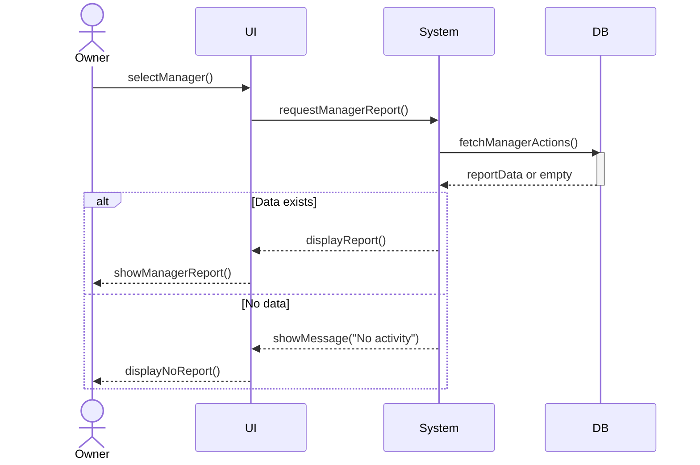

```mermaid
sequenceDiagram
    actor Owner
    participant UI
    participant System
    participant DB

    Owner->>UI: selectManager()
    UI->>System: requestManagerReport()
    System->>DB: fetchManagerActions()
    activate DB
    DB-->>System: reportData or empty
    deactivate DB

    alt Data exists
        System-->>UI: displayReport()
        UI-->>Owner: showManagerReport()
    else No data
        System-->>UI: showMessage("No activity")
        UI-->>Owner: displayNoReport()
    end
```
