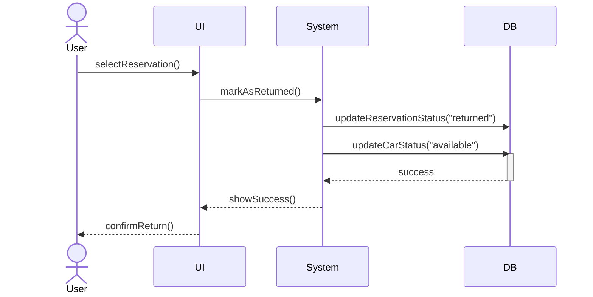

```mermaid
sequenceDiagram
    actor User
    participant UI
    participant System
    participant DB

    User->>UI: selectReservation()
    UI->>System: markAsReturned()
    System->>DB: updateReservationStatus("returned")
    System->>DB: updateCarStatus("available")
    activate DB
    DB-->>System: success
    deactivate DB

    System-->>UI: showSuccess()
    UI-->>User: confirmReturn()
```
