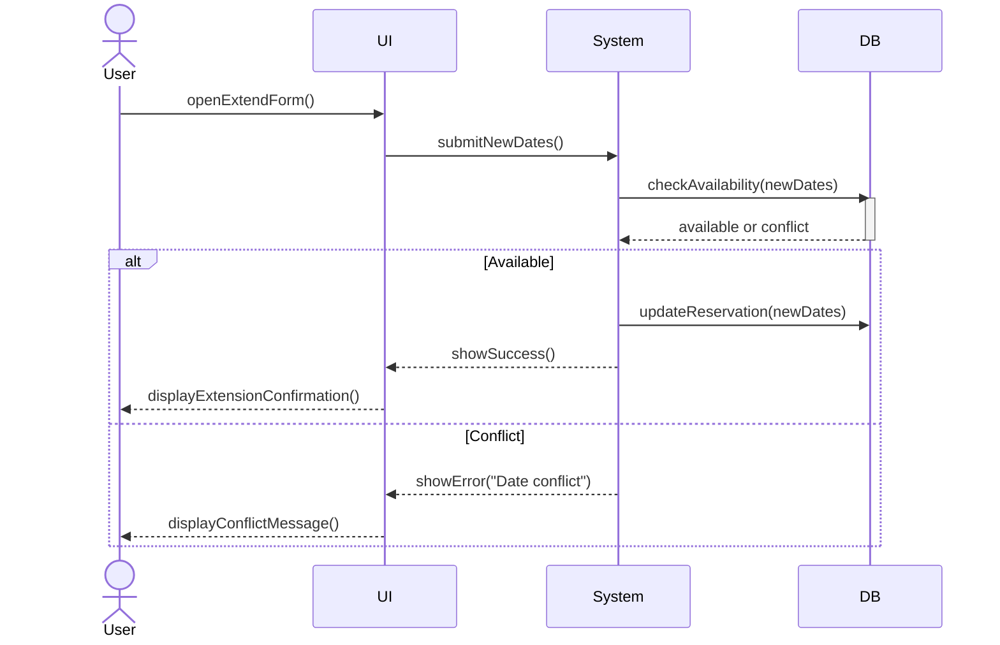

```mermaid
sequenceDiagram
    actor User
    participant UI
    participant System
    participant DB

    User->>UI: openExtendForm()
    UI->>System: submitNewDates()
    System->>DB: checkAvailability(newDates)
    activate DB
    DB-->>System: available or conflict
    deactivate DB

    alt Available
        System->>DB: updateReservation(newDates)
        System-->>UI: showSuccess()
        UI-->>User: displayExtensionConfirmation()
    else Conflict
        System-->>UI: showError("Date conflict")
        UI-->>User: displayConflictMessage()
    end
```
