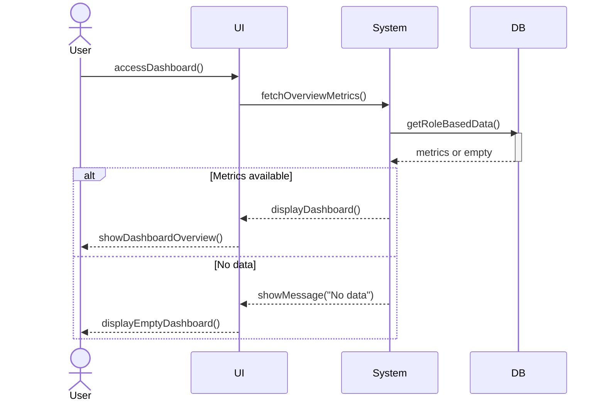

```mermaid
sequenceDiagram
    actor User
    participant UI
    participant System
    participant DB

    User->>UI: accessDashboard()
    UI->>System: fetchOverviewMetrics()
    System->>DB: getRoleBasedData()
    activate DB
    DB-->>System: metrics or empty
    deactivate DB

    alt Metrics available
        System-->>UI: displayDashboard()
        UI-->>User: showDashboardOverview()
    else No data
        System-->>UI: showMessage("No data")
        UI-->>User: displayEmptyDashboard()
    end
```
