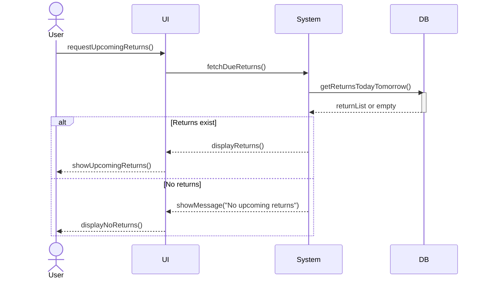

```mermaid
sequenceDiagram
    actor User
    participant UI
    participant System
    participant DB

    User->>UI: requestUpcomingReturns()
    UI->>System: fetchDueReturns()
    System->>DB: getReturnsTodayTomorrow()
    activate DB
    DB-->>System: returnList or empty
    deactivate DB

    alt Returns exist
        System-->>UI: displayReturns()
        UI-->>User: showUpcomingReturns()
    else No returns
        System-->>UI: showMessage("No upcoming returns")
        UI-->>User: displayNoReturns()
    end
```
