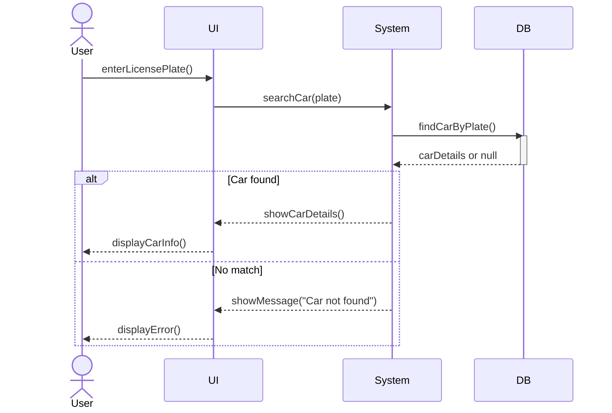

```mermaid
sequenceDiagram
    actor User
    participant UI
    participant System
    participant DB

    User->>UI: enterLicensePlate()
    UI->>System: searchCar(plate)
    System->>DB: findCarByPlate()
    activate DB
    DB-->>System: carDetails or null
    deactivate DB

    alt Car found
        System-->>UI: showCarDetails()
        UI-->>User: displayCarInfo()
    else No match
        System-->>UI: showMessage("Car not found")
        UI-->>User: displayError()
    end
```
